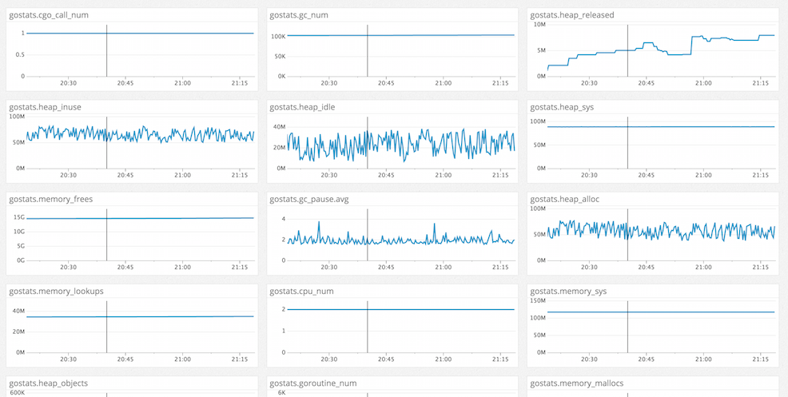

https://github.com/fukata/golang-stats-api-handler のメトリックをdatadogに送るカスタムチェックスクリプトです。

## Run go-server on local and fetch metrics (if necessary)

    go get github.com/fukata/golang-stats-api-handler
    go run server.go
    curl -i http://localhost:8080/api/stats/
    

## Put the additinal check script and config file on your datadog directory

If you use OSX, you need to put `gostats.py` to:

    /opt/datadog-agent/etc/checks.d/

and put `gostats.yaml` to:

    /opt/datadog-agent/etc/conf.d/
    
## Restart datadog-agent and confirm 

